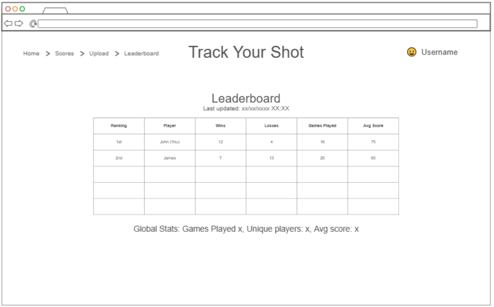

# Track your shot

Track your bid is a means to track the overall performance of players of call your shot. Meant to allow players to see their history and the history of all other players. It will allow verified users to upload new game data.  

## 🚀 Specification Deliverable

### Elevator pitch
Ever wanted to track the history of your games and see how you fare against the competition? Well now with Track your bid you can! It allows for game tracking and statistics across your career! Simply allowing everyone to see their personal history fun statistics from the ages. Also allowing for trusted members to edit and add new history. So login and claim your glory!

For this deliverable I did the following. I checked the box `[x]` and added a description for things I completed.

- [x] Proper use of Markdown
- [x] A concise and compelling elevator pitch
- [x] Description of key features
- [x] Description of how you will use each technology
- [x] One or more rough sketches of your application. Images must be embedded in this file using Markdown image references.

### Design

Here is a design of the Leaderboard page where one can see the currently best performing players and global statistics.

### Key features

- Ability to see data from mange different games and times
- Ability to see personalized data and performace
- Data uploading capabilities
- Global tracking of players performance

### Technologies

I am going to use the required technologies in the following ways.

- **HTML** - Uses correct HTML structure for application. 4 HTML pages. One for login, Leaderboard, Uploading, Game history.
- **CSS** - Enchances the users perception of the website and adds interesting effects to higher performace players.
- **React** - Provides login and the use of React for routing and components.
- **Service** - Backend storage to login information and services for score keeping and statistical analysis.
- **DB/Login** - Store users and games history. Register and login users. Credentials securely stored in database. Can't see personal data unless authenticated nor upload data.
- **WebSocket** - As new games get uploaded the scoreboards and personal history will be updated automatically.

## 🚀 AWS deliverable

For this deliverable I did the following. I checked the box `[x]` and added a description for things I completed.

- [x] **Server deployed and accessible with custom domain name** - [My server link](https://yourdomainnamehere.click).

## 🚀 HTML deliverable

For this deliverable I did the following. I checked the box `[x]` and added a description for things I completed.

- [x] **HTML pages** - I created 5 HTML pages for the website.
- [x] **Proper HTML element usage** - I used proper HTML elemements to create my pages.
- [x] **Links** - My pages link to each other via html elements.
- [x] **Text** - I used text to demonstrate how the website will look when in use.
- [x] **3rd party API placeholder** - The 3rd party API will be where I get all my data from for the tables.
- [x] **Images** - I created an image for the website icon.
- [x] **Login placeholder** - I created a login and signup page.
- [x] **DB data placeholder** - I created placed that data will be populated, uploaded, and quieried.
- [x] **WebSocket placeholder** - I created a place to show when it was last updated, which will be a websocket.

## 🚀 CSS deliverable

For this deliverable I did the following. I checked the box `[x]` and added a description for things I completed.

- [ ] **Header, footer, and main content body** - I did not complete this part of the deliverable.
- [ ] **Navigation elements** - I did not complete this part of the deliverable.
- [ ] **Responsive to window resizing** - I did not complete this part of the deliverable.
- [ ] **Application elements** - I did not complete this part of the deliverable.
- [ ] **Application text content** - I did not complete this part of the deliverable.
- [ ] **Application images** - I did not complete this part of the deliverable.

## 🚀 React part 1: Routing deliverable

For this deliverable I did the following. I checked the box `[x]` and added a description for things I completed.

- [ ] **Bundled using Vite** - I did not complete this part of the deliverable.
- [ ] **Components** - I did not complete this part of the deliverable.
- [ ] **Router** - I did not complete this part of the deliverable.

## 🚀 React part 2: Reactivity deliverable

For this deliverable I did the following. I checked the box `[x]` and added a description for things I completed.

- [ ] **All functionality implemented or mocked out** - I did not complete this part of the deliverable.
- [ ] **Hooks** - I did not complete this part of the deliverable.

## 🚀 Service deliverable

For this deliverable I did the following. I checked the box `[x]` and added a description for things I completed.

- [ ] **Node.js/Express HTTP service** - I did not complete this part of the deliverable.
- [ ] **Static middleware for frontend** - I did not complete this part of the deliverable.
- [ ] **Calls to third party endpoints** - I did not complete this part of the deliverable.
- [ ] **Backend service endpoints** - I did not complete this part of the deliverable.
- [ ] **Frontend calls service endpoints** - I did not complete this part of the deliverable.
- [ ] **Supports registration, login, logout, and restricted endpoint** - I did not complete this part of the deliverable.

## 🚀 DB deliverable

For this deliverable I did the following. I checked the box `[x]` and added a description for things I completed.

- [ ] **Stores data in MongoDB** - I did not complete this part of the deliverable.
- [ ] **Stores credentials in MongoDB** - I did not complete this part of the deliverable.

## 🚀 WebSocket deliverable

For this deliverable I did the following. I checked the box `[x]` and added a description for things I completed.

- [ ] **Backend listens for WebSocket connection** - I did not complete this part of the deliverable.
- [ ] **Frontend makes WebSocket connection** - I did not complete this part of the deliverable.
- [ ] **Data sent over WebSocket connection** - I did not complete this part of the deliverable.
- [ ] **WebSocket data displayed** - I did not complete this part of the deliverable.
- [ ] **Application is fully functional** - I did not complete this part of the deliverable.
